<h1 align="center">Kebon.Id App</h1>
<p align="center">
  
  
</p>
<p align="center">
  Built with React Native.
</p>

## Table of Contents

- [Introduction](#introduction)
- [Features](#features)
- [Requirements](#requirements)
- [Usage](#usage-for-development)
- [Create Environment Variable](#create-environment-variable)
- [Screenshots](#screenshots)
- [Release APK](#release-apk)
- [Related Project](#related-project-backend)
- [Contributors](#contributors)

## Introduction

<b>Kebon.Id App</b> is a simple e-commerce mobile application that can engaged in agriculture where the target is farmers who can sell their products through this application and the target buyers are people who do not want to queue in the market only through the application of goods can be sent according to procedure.

## Features

- Users/Customers who are not logged in can only view the product
- Users/Customers must sign up and sign in to make a transaction and see their profiles
- Farmers can add their products to sell to customers
- Users/Customers can add the products to their wishlist and their cart for later transaction
- And others

## Requirements

- [`npm`](https://www.npmjs.com/get-npm)
- [`react-native`](https://facebook.github.io/react-native/docs/getting-started)
- [`react-native-cli`](https://facebook.github.io/react-native/docs/getting-started)
- [`Backend Kebon.id`](https://github.com/AdmiralYuuShi/Backend-Kebonid.git)

## Usage for development

1. Open your terminal or command prompt
2. Type `git clone https://github.com/AdmiralYuuShi/Frontend-Kebonid.git`
3. Open the folder and type `npm install` for install dependencies
4. Create Environment Variable [here](#create-environment-variable)
5. Before run this, you must run backend first
6. Type `react-native run-android` for run this app. **_Make sure your device is connected with debugging mode_**.

## Create Environment Variable

```
$ cp .env.example .env
$ nano .env
```

```
# Set API KEY
API_KEY_URL=YOUR_HOST_URL
API_KEY_PHOTO=YOUR_HOST_PHOTO
```

## Screenshots

<div align="center">
    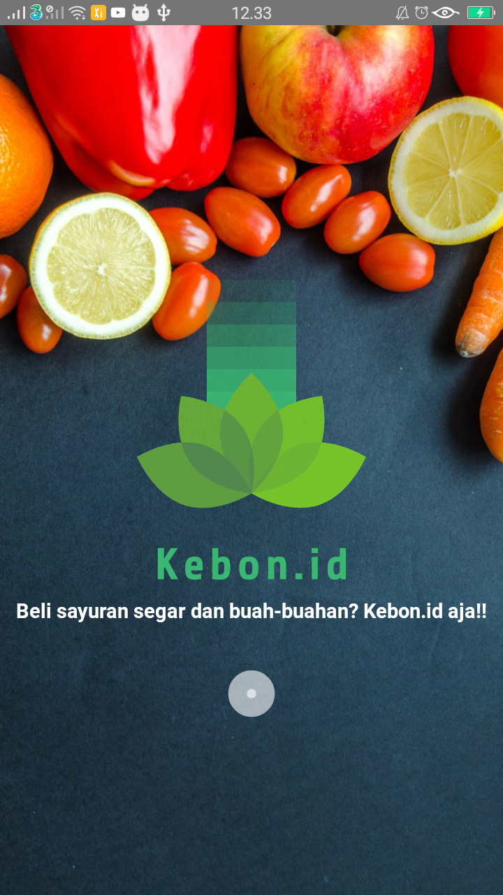   
    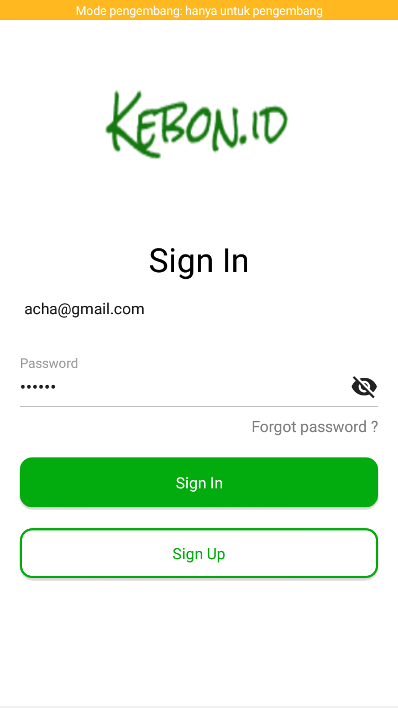
    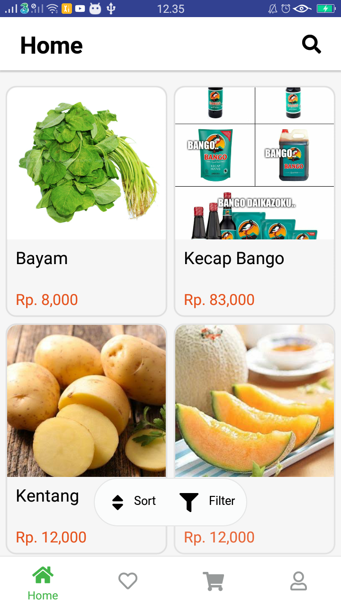
</div>
<div align="center">
    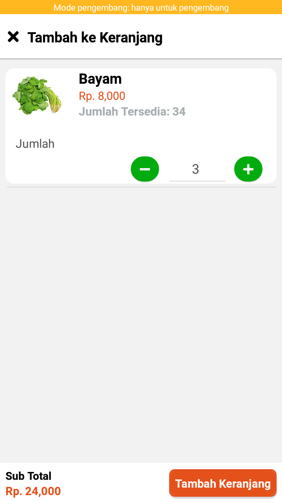   
    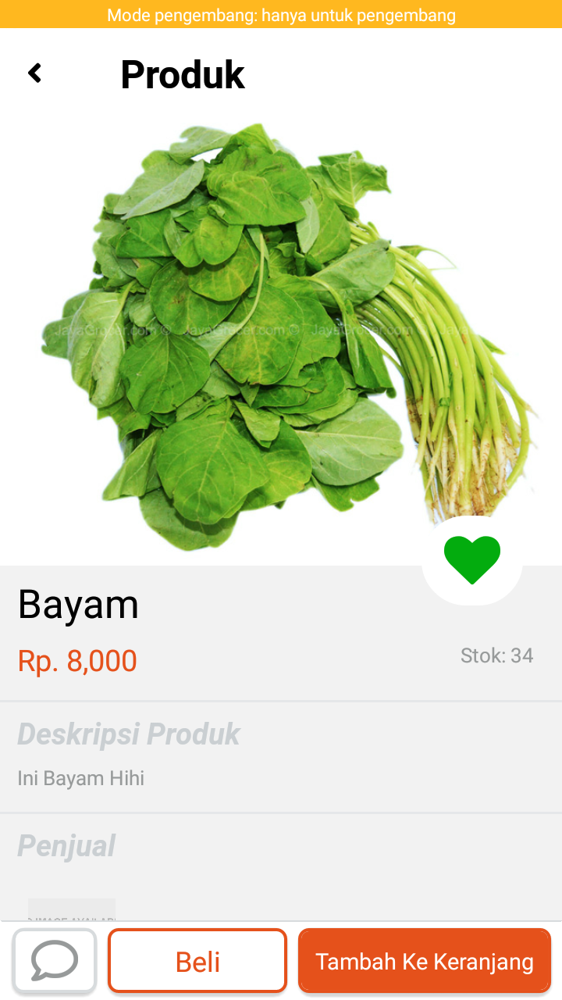
    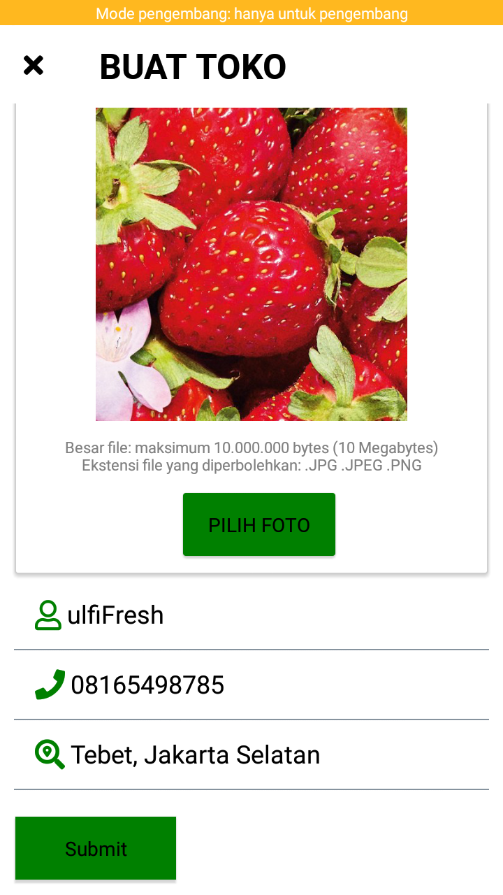
</div>
<div align="center">
    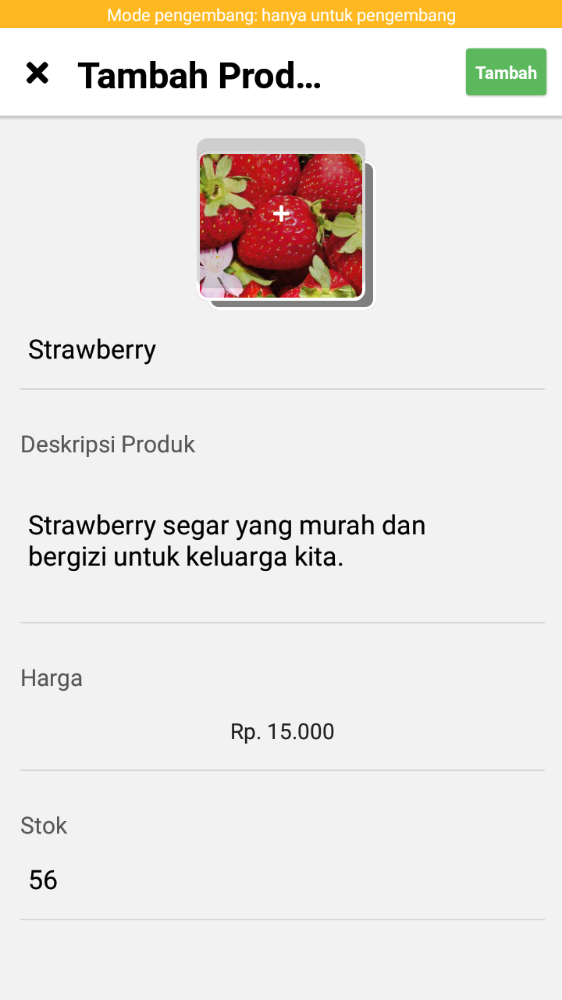   
    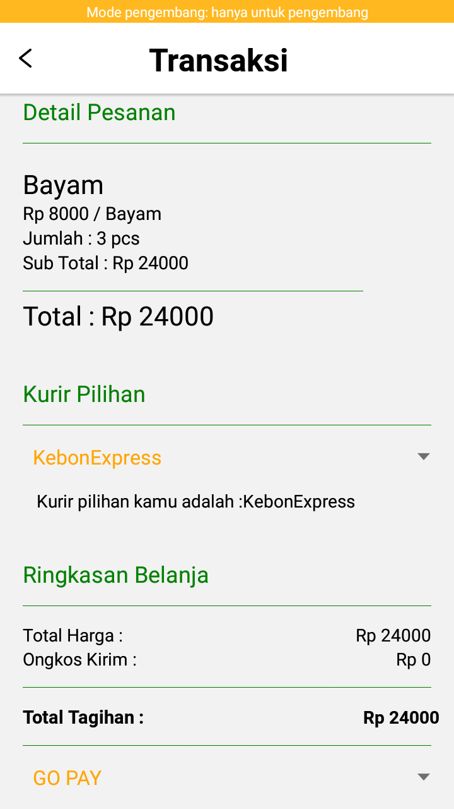
    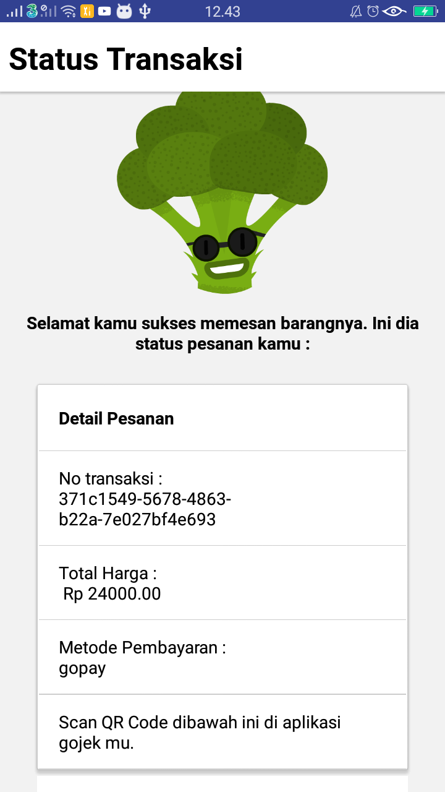
</div>
<div align="center">
    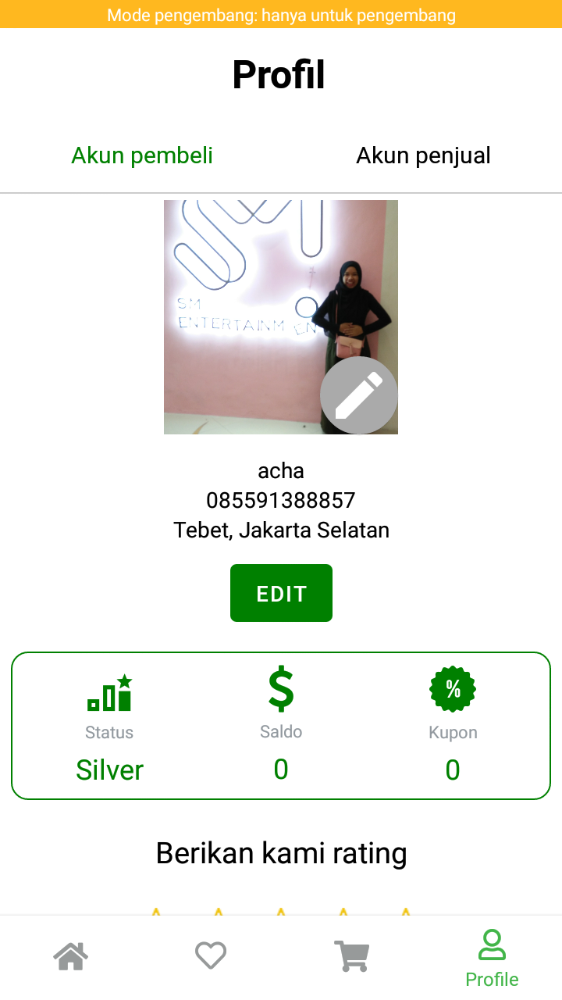   
    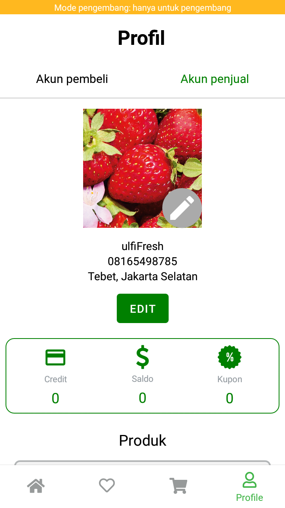
    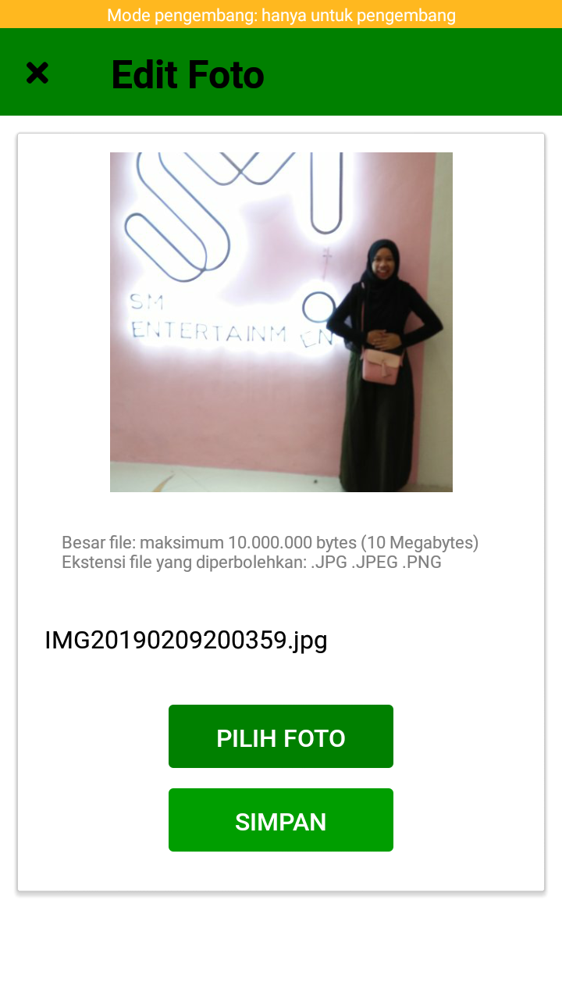
</div>

## Release APK

<a href="https://drive.google.com/file/d/1FnNj6UN7lHS7SSvX2s3LsN7swwnscQzh/view?usp=drivesdk">
  
</a>

## Related Project (Backend)

- [`Backend Kebon.id`](https://github.com/AdmiralYuuShi/Backend-Kebonid.git)

## Contributors

<center>
  <table>
    <tr>
      <td align="center">
        <a href="https://github.com/kurniawandenyy">
          <br/>
          <sub><b>Deny Kurniawan</b></sub>
        </a>
      </td>
      <td align="center">
        <a href="https://github.com/AdmiralYuuShi">
          <br/>
          <sub><b>Hapid Moch Jamil</b></sub>
        </a>
      </td>
      <td align="center">
        <a href="https://github.com/ihsan2">
          <br/>
          <sub><b>Nur Ihsan</b></sub>
        </a>
      </td>
      <td align="center">
        <a href="https://github.com/alfatahh54">
          <br/>
          <sub><b>Alfatah Hidayat</b></sub>
        </a>
      </td>
      <td align="center">
        <a href="https://github.com/VikaVP">
          <br/>
          <sub><b>Vika Vitaloka P</b></sub>
        </a>
      </td>
    </tr>
  </table>
</center>
